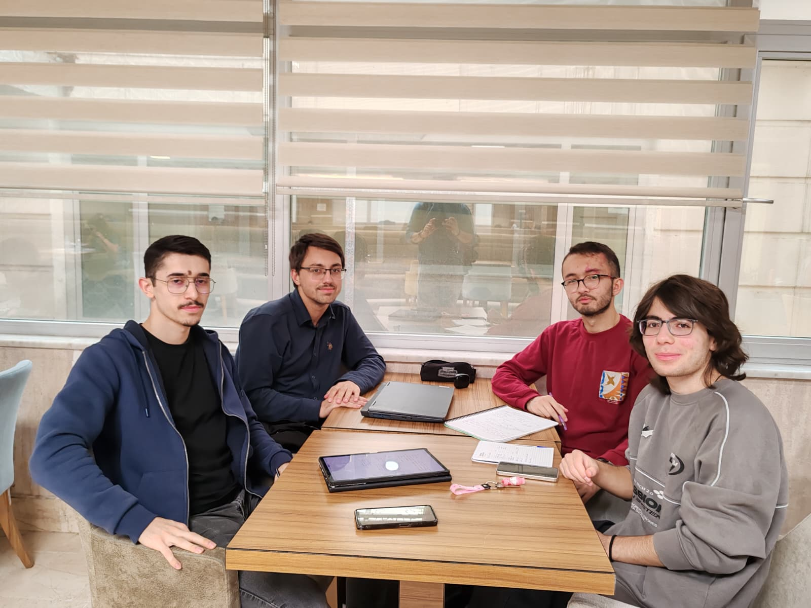

# FocusPath 
### Measure your time and productivity

FocusPath is a comprehensive time tracking and productivity monitoring system designed for Linux. It actively monitors user activities by tracking window focus changes and browser interactions, then compares your actual work patterns against your planned workflow, visualizing the results through intuitive efficiency metrics and interactive graphs.

## Overview

FocusPath helps you understand how you spend your time by first letting you define your intended workflow, then automatically recording which applications you use and how actively you're working. The system consists of several interconnected components that work together to capture, process, compare, and visualize your productivity data against your plans.
 
We also came together and decided this project and its details. Here is a photo from the meeting:

  

## Students
Ali Haydar Sucu

Alpdoğan Kurt

Fatih Şenal

Burak Semih Bileci
